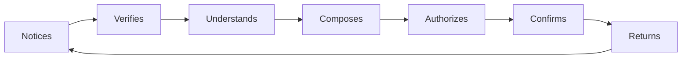

# Customer Journey Map: Edge Mail Operator — From Alert to Proven Resolution

## Executive Summary

This cyclical journey follows a technical operator who must turn new shared-domain mail into an authorized, auditable resolution. Repository evidence establishes the workflow and safety boundaries, but no customer research establishes emotional states, so every emotion is explicitly a low-confidence hypothesis. The largest structural pain is reconstructing truth across policy, Cloudflare state, message storage, and delivery evidence. The most important moment of truth is the reply gate: the operator must understand and trust the selected domain identity before any external send is authorized.

## Persona / Segment

The Edge Mail Operator is a founder-operator, platform engineer, or technical operations lead responsible for shared role mail and domain reputation. They are comfortable with infrastructure but need everyday triage to stay fast, calm, and evidence-aware. See `docs/product/PERSONA.md`.

## Journey Scope

- **Journey type:** Cyclical
- **Included:** new-mail attention, triage, conversation review, reply authorization, delivery evidence, and return to the queue
- **Excluded:** initial Cloudflare account provisioning, marketing discovery, billing, broad helpdesk administration, and long-term retention

## Stages

| # | Stage | Customer goal | Duration | Entry trigger | Exit criterion |
| --- | --- | --- | --- | --- | --- |
| 1 | Notices | Learn what needs attention | Seconds to minutes | New message or exception appears | One item is selected with a understood priority |
| 2 | Verifies | Confirm route and evidence state | Under a minute | Thread selected | Operator understands alias, route, readiness, and storage state |
| 3 | Understands | Read the conversation safely | Minutes | Authorized detail opens | Intent and relevant history are clear |
| 4 | Composes | Prepare the right response | Minutes | Response is warranted | Content and recipients are ready |
| 5 | Authorizes | Confirm the domain identity and protected action | Seconds | Operator reaches reply gate | Server accepts an authorized queued reply or rejects it clearly |
| 6 | Confirms | Establish delivery or recovery truth | Seconds to asynchronous | Queue event arrives | Delivered, failed, or pending state is explicit |
| 7 | Returns | Resume the attention loop | Immediate | Resolution or deferral recorded | Next actionable item is visible |

## Touchpoints per Stage

| Stage | Touchpoint | Channel | What happens |
| --- | --- | --- | --- |
| Notices | Desk overview | Web | Attention list and operational exceptions load |
| Verifies | Route/evidence rail | Web | Alias, route kind, selected operators, and proof plane appear |
| Understands | Thread detail | Web | Authorized messages and participants are read |
| Composes | Reply composer | Web | Operator writes a bounded reply |
| Authorizes | Identity and queue gate | Web/API | Router authorizes operator and From identity before queueing |
| Confirms | Audit timeline | Web/Queue | Attempt and provider result remain separate events |
| Returns | Desk overview | Web | Thread state updates and attention moves on |

## Emotional Curve

| Stage | Dominant emotion | Confidence | Source |
| --- | --- | --- | --- |
| Notices | Alert curiosity, mild uncertainty | Low | Hypothesis |
| Verifies | Skepticism shifting toward control | Low | Hypothesis |
| Understands | Focus | Low | Hypothesis |
| Composes | Deliberation | Low | Hypothesis |
| Authorizes | Productive caution | Low | Hypothesis |
| Confirms | Relief or contained concern | Low | Hypothesis |
| Returns | Quiet momentum | Low | Hypothesis |

## Pain Points and Moments of Truth

| Stage | Pain / Moment of Truth | Severity | Customer evidence | Implication |
| --- | --- | --- | --- | --- |
| Notices | Priority cannot be inferred from raw totals | 4 | Product-contract hypothesis | Lead with attention states |
| Verifies | Local/source state may be mistaken for live truth | Moment of Truth (5) | Repository readiness doctrine | Label every evidence plane |
| Understands | Sensitive content could leak outside authorized detail | 5 | Runtime/security contract | Scope queries and avoid ambient previews |
| Authorizes | Operator must trust the selected reply identity | Moment of Truth (5) | Router contract | Make server authorization visible before queueing |
| Confirms | Queued can be mistaken for delivered | Moment of Truth (5) | Queue/audit contract | Use distinct pending, attempted, delivered, and failed states |

## Opportunities

| Stage | Opportunity | Product change that addresses it | Effort |
| --- | --- | --- | --- |
| Notices | Reduce reconstruction work | Action-oriented split-pane desk | Medium |
| Verifies | Make proof legible | Four-plane readiness rail with freshness | Small |
| Understands | Protect content without losing context | Authorized bounded thread projection | Medium |
| Composes | Preserve domain continuity | Identity-first composer | Medium |
| Authorizes | Turn policy into confidence | Explain authorized/default identity at the gate | Small |
| Confirms | Make recovery obvious | Audit timeline with explicit pending/failure actions | Medium |
| Returns | Maintain momentum | Preserve selection and attention ordering | Small |

## Visual

## Research Gaps

- Observe five target operators to validate stage order, duration, and attention heuristics.
- Test whether the four-plane readiness model is understandable without repository vocabulary.
- Learn whether routine operators and deployment administrators are one persona or two.
- Validate which failures warrant interruption versus quiet audit visibility.
