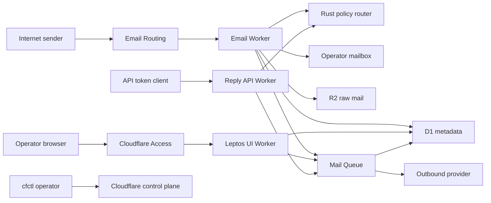

# maildesk-cf Threat Model

## Executive summary

`maildesk-cf` crosses several high-value trust boundaries: internet email enters an Email Worker, policy decisions cross a Rust/WASM boundary, sensitive mail is split across D1 and R2, operators enter through Cloudflare Access, and outbound replies leave through a Queue and sender provider. The Access-protected desk is the default reply path; the legacy shared-token API is disabled unless explicitly enabled, and outbound audits redact bodies, BCC, headers, and raw provider responses. The highest residual risks now depend on unconfirmed live Access routing, retention, role topology, rate limits, and whether a service-bound legacy API is required.

## Scope and assumptions

- In scope: Rust router, inbound Email Worker, reply/API Worker, Queue consumer, Leptos UI Worker, D1/R2 data contracts, Wrangler bindings, and production control-plane scripts.
- Runtime behavior is separated from CI/build and local operator tooling. Tests are evidence of intent, not deployed controls.
- Conditional assumption: one private organization operates one deployment; `/` and `/architecture` are public, while `/desk*` is protected by one Cloudflare Access application.
- Conditional assumption: authorization is initially route membership plus a small explicit administrator group; multi-tenancy is out of scope.
- Conditional assumption: raw MIME and attachments are confidential, are not exposed in the first UI, and should default to a 30-day R2 lifecycle until the owner confirms another period.
- Conditional assumption: the legacy `/api/replies` Worker remains disabled unless it is Access/service-bound; a public shared-bearer endpoint is not an accepted final topology.
- Out of scope: Cloudflare platform vulnerabilities, compromise of the operator workstation/account, third-party mailbox-provider internals, and attacks requiring write access to trusted deployment configuration.

Open questions that materially change risk ranking:

1. Will `/api/replies` be retired, Access-protected, or retained as a public service-token API?
2. What retention and deletion requirements apply to raw MIME, attachments, audit details, and provider responses?
3. Is route membership sufficient, or must administrator/operator roles and tenant separation be enforced?

Conclusions that depend on the open questions remain conditional and do not authorize production deployment.

## System model

### Primary components

- **Email Worker:** accepts Cloudflare Email Routing events, invokes Rust policy, forwards accepted mail, and writes D1/R2/Queue state (`workers/mail-router/src/index.ts`).
- **Rust router:** owns alias matching, operator selection, default identity, and reply authorization (`crates/maildesk-router/src/lib.rs`).
- **API/Queue Worker:** exposes health/readiness, conditionally exposes legacy `/api/replies`, consumes jobs, selects the sender adapter, and records redacted audits (`workers/mail-api/src/index.ts`).
- **Leptos UI Worker:** serves public routes and `/desk*`; a TypeScript shim validates Access JWTs before Rust server functions trust the identity (`workers/ui/access.ts`, `scripts/write-ui-worker-shim.mjs`, `src/lib.rs`).
- **D1, R2, and Queue:** store metadata/audits, raw MIME/blobs, and asynchronous work respectively (`migrations/0001_maildesk_core.sql`, `wrangler*.toml`).
- **cfctl control plane:** plans, acknowledges, applies, and verifies Cloudflare resource changes (`docs/operations/cfctl-contract.md`, `scripts/preflight.ts`).

### Data flows and trust boundaries

- Internet sender → Cloudflare Email Routing → Email Worker: RFC822 content and envelope data cross SMTP/email-event boundaries. Cloudflare invokes the Worker; the app normalizes the recipient and fails closed on invalid or unavailable policy. Source-visible per-sender quotas and message-size enforcement are absent.
- Email Worker → Rust/WASM router: normalized recipient and server-owned policy cross an in-process JSON/WASM adapter. Rust validates policy and rejects unknown domains, aliases, operators, and identities.
- Email Worker → operator mailbox, D1, R2, and Queue: accepted mail is forwarded, metadata is parameter-bound into D1, raw content is written to R2, and jobs are queued. Retention and deployed resource isolation are control-plane responsibilities not proven by source.
- Browser → Cloudflare Access → UI shim → Leptos server: Access assertion crosses HTTPS. The shim validates RS256 signature, issuer, audience, expiry, and email against Cloudflare JWKS; the Rust server additionally requires the shim-only validation marker, route membership, and same-origin browser metadata.
- API client → `/api/replies`: this boundary is absent by default. In explicit `token` mode, a static bearer/header token crosses HTTPS; the request supplies operator, recipients, subject, body, BCC, and requested identity, while router authorization binds operator to identity but not the token to a principal.
- UI/API → Queue → sender provider: an authorized reply job crosses an at-least-once asynchronous boundary. The provider adapter checks configured sender mode and verified sender domain; audits record request/result state.
- Operator workstation → cfctl → Cloudflare API: account mutations require plan, explicit operation-ID acknowledgement, and targeted readback. Local scripts and credentials remain a privileged operator boundary.

#### Diagram

## Assets and security objectives

| Asset | Why it matters | Security objective (C/I/A) |
| --- | --- | --- |
| Raw MIME and attachments | May contain private business, personal, financial, or authentication content | C, I, A |
| Thread/message metadata | Reveals correspondents, subject lines, routing, and operational history | C, I, A |
| Route and identity policy | Determines who receives mail and which identities may send | I, A |
| Access assertions and API tokens | Grant operator or automation capabilities | C, I |
| Cloudflare and sender-provider credentials | Permit resource or mail-sending control | C, I |
| Reply jobs and sender identity | Incorrect mutation can impersonate a domain or send to unintended recipients | I, A |
| Audit log | Must support investigation without becoming an uncontrolled content store | C, I, A |
| D1/R2/Queue bindings and Worker routes | Misbinding can expose or corrupt production data | C, I, A |
| Build artifacts and deployment plans | Define the code and account state promoted to production | I, A |

## Attacker model

### Capabilities

- Remote internet senders can choose envelope/header values and send attacker-controlled RFC822 content to configured public aliases.
- Unauthenticated internet clients can reach any Worker route exposed by deployed routing, including health endpoints and potentially `/api/replies` if not Access/service-bound.
- If the disabled-by-default legacy route is deliberately enabled, a stolen or leaked shared reply API token can submit syntactically valid reply requests.
- An authenticated operator can attempt to access other routes, threads, identities, or manipulate reply inputs.
- Attackers can replay requests and exploit at-least-once Queue behavior where idempotency is incomplete.

### Non-capabilities

- Attackers are not assumed to modify trusted Rust policy, Wrangler configuration, cfctl plans, Worker secrets, or Cloudflare account state without first compromising a privileged boundary.
- Attackers are not assumed to forge a valid Cloudflare Access JWT for the configured issuer and audience.
- Cloudflare platform isolation, TLS, Email Routing invocation authenticity, and provider internals are treated as external platform controls.

## Entry points and attack surfaces

| Surface | How reached | Trust boundary | Notes | Evidence |
| --- | --- | --- | --- | --- |
| Email Worker `email` handler | Public inbound email alias | Internet → Cloudflare → Worker | Attacker controls MIME and many headers | `workers/mail-router/src/index.ts` / `email` |
| `/api/replies` | Explicit opt-in HTTP POST | Service client → API Worker | Disabled by default; shared token mode lets caller supply operator and destinations | `workers/mail-api/src/index.ts` / `queueReply` |
| `/healthz`, `/readyz` | HTTP GET | Internet → API Worker | Intentionally unauthenticated; should reveal status only | `workers/mail-api/src/index.ts` / `fetch` |
| `/desk*` | HTTPS through Access | Browser → Access → UI shim → Rust SSR | JWT verification plus route-membership authorization | `workers/ui/access.ts` / `verifiedAccessRequest`; `src/lib.rs` / `desk_auth_gate` |
| `/desk/api` server functions | Authenticated browser POST | Browser → Rust server functions | Same-origin metadata and size caps; D1/Queue access | `src/api.rs`; `src/server/desk.rs` |
| Queue consumer | Cloudflare Queue | Producers → consumer → provider/D1 | At-least-once delivery and external send side effects | `workers/mail-api/src/index.ts` / `queue` |
| Policy JSON | Worker text/R2/local file | Operator config → router | Integrity-critical, schema-validated policy | `workers/shared/router.ts`; `crates/maildesk-router/src/lib.rs` |
| cfctl plan/apply scripts | Local privileged CLI | Operator workstation → Cloudflare API | Explicit plan/ack model; credentials are high value | `scripts/preflight.ts`; `docs/operations/production-rollout.md` |

## Top abuse paths

1. **Impersonate an operator through an enabled legacy API:** operator explicitly enables token mode without a service boundary → attacker obtains one API token → submits any policy-listed operator and allowed identity plus arbitrary recipients/content → causes impersonation, phishing, or disclosure.
2. **Regress audit redaction:** a future adapter serializes a complete outbound job or provider response into audit detail → a D1 reader recovers full body, HTML, BCC, or headers → the blast radius exceeds the intended content-store boundary.
3. **Bypass the desk identity boundary through deployment drift:** expose a non-Access origin or omit the JWT shim → inject Access-looking headers → become a route member identity → read threads or queue replies. The tracked UI config and shim mitigate this, but live routing remains unverified.
4. **Exhaust storage and operator attention through inbound mail:** repeatedly send large/complex mail to a valid role alias → trigger forwarding, R2 writes, D1 writes, and Queue work → consume cost and degrade mail operations.
5. **Exploit thread grouping semantics:** craft unusual `Message-ID`/reply chains → attempt to confuse operator context. Current IDs hash the exact trimmed, case-preserving Message-ID together with the normalized route address, but full conversation threading remains a product-level design boundary.
6. **Retain sensitive mail beyond business need:** send sensitive content → store raw MIME/attachments indefinitely because lifecycle is unset → later account or binding compromise exposes historical material.
7. **Broaden sender authorization through configuration:** set verified sender domains to wildcard or deploy compromised policy → pass runtime domain checks for more identities → send mail from unintended configured domains.
8. **Create a claimed-but-unresolved send:** interrupt a Worker after its durable send claim but before its result event → Resend may resume only with the same recorded provider and stable idempotency key, while other or provider-drifted claims require deliberate recovery.

## Threat model table

| Threat ID | Threat source | Prerequisites | Threat action | Impact | Impacted assets | Existing controls (evidence) | Gaps | Recommended mitigations | Detection ideas | Likelihood | Impact severity | Priority |
| --- | --- | --- | --- | --- | --- | --- | --- | --- | --- | --- | --- | --- |
| TM-001 | Stolen token or authorized automation | Legacy `token` mode is explicitly enabled; attacker obtains a token and knows a valid policy operator/identity | Supply an arbitrary policy-listed operator, recipients, BCC, and content to `/api/replies` | Domain impersonation, unintended recipients, phishing, disclosure | API tokens, sender identity, reply jobs, audit | Route defaults to disabled; router and sender-domain controls still apply (`workers/mail-api/src/index.ts`, `wrangler.toml`) | In token mode, token is not bound to the operator and destinations are not loaded from the thread | Keep disabled, or require Access/service identity and bind recipients/thread server-side; use scoped, rotated credentials | Alert on mode drift, token use, novel recipient domains, BCC use, and volume anomalies | Low while disabled; high if public | High | High conditional |
| TM-002 | D1 reader or future code regression | Audit redaction is removed or bypassed | Query audit rows after full outbound jobs/provider responses are reintroduced | Full content or private delivery metadata disclosed | Mail content, correspondents, audit | Audit projections omit body, HTML, BCC, headers, raw provider response, and provider exception text; contract tests bound persisted failure metadata (`workers/mail-api/src/index.ts`, `tests/workers/mail-api.test.ts`) | No schema-level audit payload allowlist | Add a versioned audit-detail schema; keep message body in the designated content store | Scan audit payload keys; alert on bulk reads and oversized details | Low | High | Medium |
| TM-003 | Remote client exploiting deployment drift | A Worker origin or route bypasses Access, or shim/config is removed | Forge identity-looking headers and reach `/desk*` | Cross-route data access and unauthorized replies | Access identity, D1 metadata, sender identity | RS256/JWKS issuer/audience validation (`workers/ui/access.ts`); shim-only marker (`src/lib.rs`); `workers_dev=false` (`wrangler.ui.toml`) | Live Access application, hostname coverage, audience, and alternate origins are unverified | Verify every production hostname/route with cfctl; fail preflight on missing Access app/audience; keep public and desk routes explicitly partitioned | Log JWT validation failures, direct-origin attempts, and unexpected hostnames | Low with correct routing; high if drift exists | High | High conditional |
| TM-004 | External sender or later storage reader | Valid public alias and absent/overbroad lifecycle/access policy | Cause confidential MIME/attachments to remain in R2 and later exploit a read boundary | Historical sensitive-content exposure | Raw MIME, attachments | R2 keys are separated from D1 metadata; no first-release UI read path (`workers/mail-router/src/index.ts`, `migrations/0001_maildesk_core.sql`) | Retention, deletion, encryption/access review, and lifecycle readback are unconfirmed | Apply explicit R2 lifecycle; add audited deletion; prohibit public buckets; document legal holds and restore behavior | Lifecycle drift check, object-age distribution, access audit | Medium | High | High conditional |
| TM-005 | Internet email sender | Knowledge of a valid alias | Send high-volume or maximum-size MIME to trigger forwarding, R2, D1, and Queue work | Cost growth, delayed processing, operator overload | Worker/Queue availability, R2/D1 cost | Unknown aliases rejected; policy-selected forwarding only; Queue retries bounded (`workers/mail-router/src/index.ts`, `wrangler.toml`) | No source-visible per-sender/alias quota, body cap, or abuse circuit breaker | Enforce platform limits and route-specific quotas; cap stored/parsed size; quarantine excess; add backpressure/dead-letter policy | Rate, size, queue-lag, R2-write, and forward-failure alerts | Medium | Medium | Medium |
| TM-006 | Internet email sender | Ability to choose `Message-ID` and unusual reply chains | Attempt identifier collision or thread-context confusion | Cross-message/thread confusion or integrity loss | Thread state, audit | Thread IDs use SHA-256 of route plus case-preserving Message-ID; regression tests cover former punctuation/case collisions; delivery IDs separate raw objects (`workers/mail-router/src/index.ts`) | Full reply-chain grouping remains intentionally narrow | Add conversation-key rules and parent tests before richer threading | Multiple roots/in-reply-to anomalies per route | Low | Medium | Low |
| TM-007 | Queue interruption or repeated client | Worker stops after a durable claim or an authorized user submits twice with distinct IDs | Leave a claimed job without a delivery result, or create two separate authorized intents | Missed or duplicate reply requiring recovery | Reply jobs, sender reputation, audit | The claim records provider mode; completed claims deduplicate; transient Resend failures retry with one stable idempotency key; Cloudflare and provider-drifted claims become recovery-required (`workers/mail-api/src/index.ts`) | Cloudflare Email Service has no source-visible provider idempotency key; desk-level recovery aggregation remains absent | Alert on recovery-required actions, add bounded manual recovery, and retain provider-bound claims | Claim age, recovery-required count, repeated user intent, provider-ID mismatch | Low | Medium | Medium |
| TM-008 | Privileged config attacker or operator error | Write access to policy/runtime config | Broaden allowed identities or bypass deployment controls | Mail from unintended configured identities/domains | Policy, sender identity | Router identity authorization, explicit sender mode, and production rejection of wildcard sender domains (`crates/maildesk-router/src/lib.rs`, `scripts/preflight.ts`) | Config provenance is not runtime-attested | Generate exact allowlist from provider readback; hash policy/config in audits | Config-drift and new-domain alerts | Low | High | Medium |
| TM-009 | Data-integrity error | Duplicate operator emails differing only by case | Authorize both rows through case-folded comparison | Unexpected route membership or audit attribution | Operator mapping, thread access | Queries bind parameters and compare normalized email (`src/server/desk.rs`) | SQLite uniqueness is not visibly case-insensitive | Store canonical lowercase email and add a unique normalized index/migration | Duplicate-normalized-email preflight query | Low | Medium | Low |
| TM-010 | Privileged operator mistake or workstation compromise | Local purpose-scoped credential and apply capability | Acknowledge or apply a plan to unintended Cloudflare targets | Routing, DNS, storage, or Worker takeover/outage | Cloudflare resources, credentials, mail availability | Production preflight separately requires explicit account target, purpose-scoped child token, and healthy doctor lane; plan/ack/verify workflow remains mandatory (`scripts/preflight.ts`, `AGENTS.md`) | Plan freshness, capability scope, and target readback must still be checked per operation | Bind plan to account/zone/target and exact desired-state hash; expire plans; require live readback | Operation-ID ledger, target diffs, unauthorized-plan alerts | Low | High | Medium |

## Criticality calibration

- **Critical:** pre-auth remote code execution in a Worker; broad cross-organization raw-mail exfiltration; control-plane credential theft enabling account takeover.
- **High:** bypassing Access to read protected threads; using a shared token to send arbitrary domain-authenticated mail; disclosing complete mail bodies/BCC through a broadly readable audit store.
- **Medium:** targeted inbound cost exhaustion; thread-identifier collision; duplicate outbound sends; sender allowlist drift requiring privileged configuration access.
- **Low:** low-sensitivity readiness disclosure; case-only operator duplication requiring a provisioning failure; noisy failures with bounded retries and no sensitive-data impact.

## Focus paths for security review

| Path | Why it matters | Related Threat IDs |
| --- | --- | --- |
| `workers/mail-api/src/index.ts` | Shared-token auth, reply construction, provider calls, Queue side effects, and audit payloads converge here | TM-001, TM-002, TM-007, TM-008 |
| `workers/mail-router/src/index.ts` | Parses attacker-controlled email, derives IDs, forwards mail, and fans out storage/Queue work | TM-004, TM-005, TM-006 |
| `workers/ui/access.ts` | Cryptographic Access assertion validation and trusted identity-header construction | TM-003 |
| `scripts/write-ui-worker-shim.mjs` | Connects Access validation to the generated production Worker route boundary | TM-003 |
| `src/lib.rs` | Rust-side desk gate, origin metadata checks, size cap, and response headers | TM-003 |
| `src/server/desk.rs` | Relational thread authorization and reply enqueue logic | TM-003, TM-007, TM-009 |
| `crates/maildesk-router/src/lib.rs` | Canonical alias, operator, and reply-identity authorization | TM-001, TM-008 |
| `migrations/0001_maildesk_core.sql` | Confidential metadata, route membership, audit schema, and normalization invariants | TM-002, TM-004, TM-009 |
| `migrations/0002_audit_idempotency.sql` | Intended idempotency boundary for Queue/audit processing | TM-007 |
| `scripts/preflight.ts` | Production fail-closed checks for Access, policy, bindings, credentials, and sender mode | TM-003, TM-008, TM-010 |
| `wrangler.ui.toml` | Production origin exposure and Access-mode/binding contract | TM-003, TM-004 |
| `docs/operations/production-rollout.md` | Governs plan, acknowledgment, readback, and readiness claims | TM-010 |

## Quality check

- [x] Covered discovered HTTP, email-event, server-function, Queue, policy, storage, and control-plane entry points.
- [x] Represented every identified trust boundary in at least one abuse path and threat.
- [x] Separated runtime behavior from CI/build/local operator tooling and tests.
- [x] Kept context-dependent conclusions conditional and listed the decisions that could change risk ranking.
- [x] Listed assumptions and open questions that could change scope or priority.

## Control-plane compatibility review

Production preflight invokes `cfctl doctor --json` and recognizes the current
v2 health contract only when the running build identity, PATH build,
instruction state, and selected profile are all healthy. Cloudflare account
targeting and purpose-scoped deploy-token checks remain independent mandatory
gates; doctor health does not grant deployment authority. Verify this living
contract with `bun test ./tests/scripts/preflight.test.ts` and the complete
local CI gate rather than embedding source hashes that become stale on every
reviewed change.
